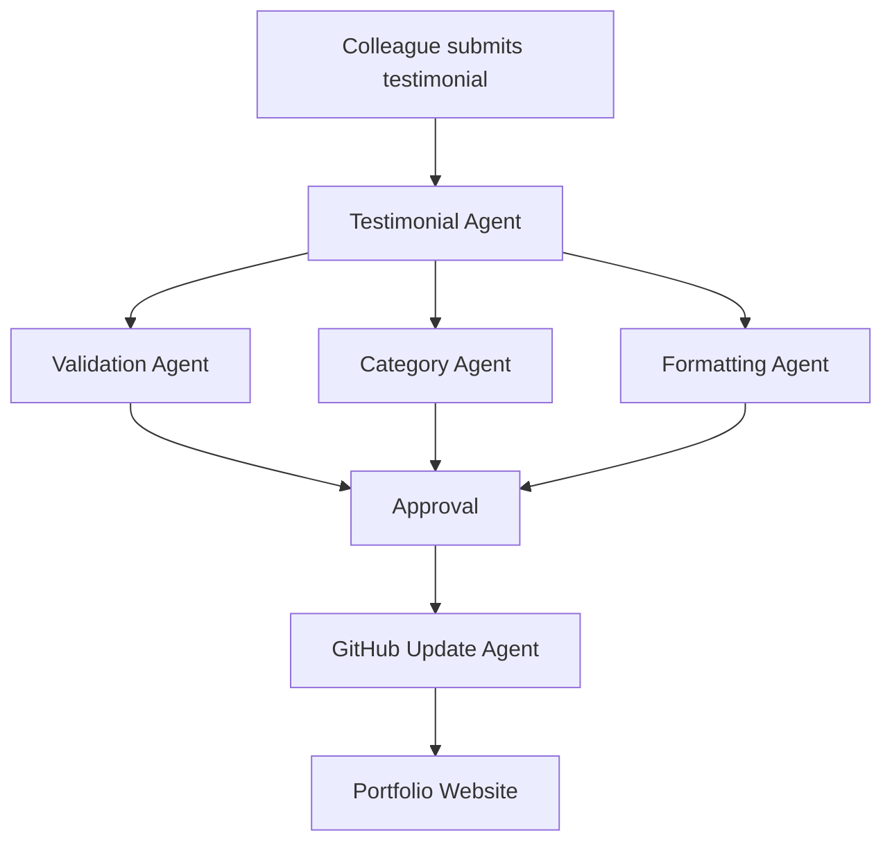

# AI-Testimonial-Agent
A human-in-the-loop AI agent system that automates testimonial collection, validation, categorization, and GitHub-based publishing while preserving original human-authored content.

## Structure
```text
GitHub
│
├── shilpah123.github.io          ← Your portfolio website
│   ├── index.html
│   ├── resume/
│   ├── images/
│   └── css/
│
├── AI-Testimonial-Agent          ← New AI agent project
│   ├── app/
│   │   ├── testimonial_agent.py
│   │   ├── github_agent.py
│   │   └── validator_agent.py
│   │
│   ├── frontend/
│   │   └── testimonial_form.html
│   │
│   ├── data/
│   │   └── testimonials.json
│   │
│   ├── README.md
│   └── requirements.txt
```

## Architecture

